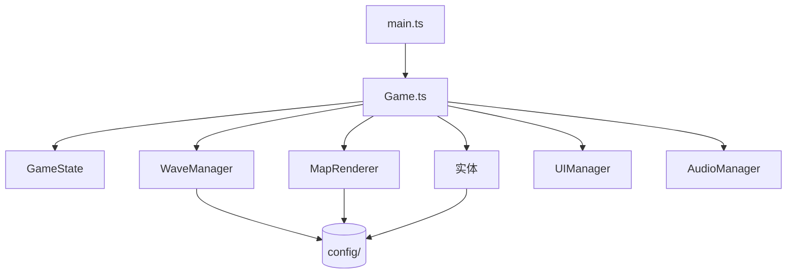

# 贡献指南 · Contributing to Meow Defense

感谢你想为喵喵防线添砖加瓦！本项目刻意采用**数据驱动架构**，让内容扩展几乎无需理解引擎内部。

## 快速开始

```bash
git clone https://github.com/modengsir/game.git
cd game
npm install
npm run dev
```

## 开发脚本

| 命令 | 作用 |
|---|---|
| `npm run dev` | 启动开发服务器（默认 http://localhost:5173） |
| `npm run build` | 类型检查 + 生产构建到 `dist/` |
| `npm run preview` | 本地预览构建产物 |

> 提交前务必保证 `npm run build` 通过（含 TypeScript 严格类型检查）。

## 项目结构

```
meow-defense/
├── src/
│   ├── main.ts              # 入口
│   ├── game/Game.ts         # 主循环与系统编排
│   ├── core/                # 基础设施：类型 / 网格 / 事件总线 / 状态
│   ├── config/              # 内容层（数据驱动）—— 90% 的贡献在这里
│   ├── entities/            # 行为实体：怪物 / 塔 / 投射物
│   ├── systems/             # 系统：地图渲染 / 波次管理
│   ├── ui/                  # DOM 界面
│   └── audio/               # WebAudio 音效
└── ...
```

架构总览（与 README 一致）：



## 常见贡献示例

### 加一种新塔

在 `src/config/towers.ts` 的 `TOWERS` 数组追加一个对象，保存即在建造栏出现，无需改其他代码：

```ts
{
  id: 'laser',
  name: '激光猫',
  emoji: '😾',
  color: 0xe24b4a,
  description: '持续激光，穿透力强。',
  projectileEmoji: '⚡',
  levels: [
    { damage: 15, range: 160, fireRate: 3, upgradeCost: 130 },
    { damage: 25, range: 175, fireRate: 3.5, upgradeCost: 140 },
    { damage: 42, range: 190, fireRate: 4, upgradeCost: 240 },
  ],
}
```

### 加一种新怪

在 `src/config/enemies.ts` 追加一个 `EnemyDef` 对象即可。

### 设计新波次 / 新地图

编辑 `src/config/levels.ts`：`path` 是网格点序列，`waves` 是每波的生成配置。

## 代码规范

- TypeScript strict 模式，提交前请确保 `npm run build` 通过（含类型检查）。
- 命名用语义化英文；面向玩家的文案用中文。
- 一个 PR 聚焦一件事，附上简短说明与（如涉及玩法）截图 / 录屏。

## 提交流程

1. Fork 并新建分支：`git checkout -b feat/laser-cat`
2. 开发并自测（`npm run dev`）
3. 确保 `npm run build` 通过
4. 提交 PR，描述改动动机与效果

## 行为准则

参与本项目即表示你同意遵守 [CODE_OF_CONDUCT.md](./CODE_OF_CONDUCT.md)。保持友善、尊重、乐于协作——这是个轻松的猫咪游戏，玩得开心最重要 🐱
