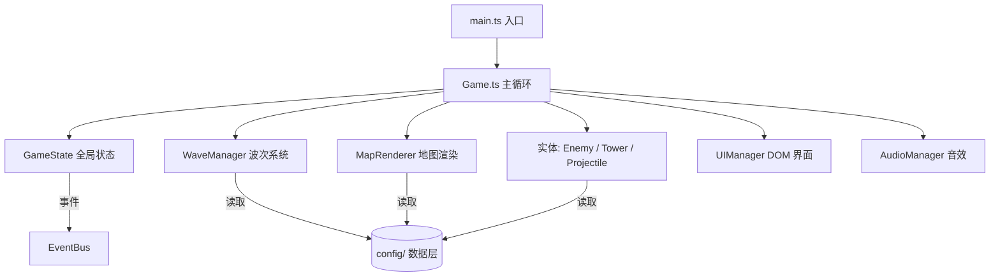

<div align="center">

# 🐱 喵喵防线 · 猫咖保卫战 (Meow Defense)

**一个用 Vite + TypeScript + PixiJS 打造的轻量 2D 塔防小游戏。**

你是猫咖店长，部署各种猫咪炮台，守住店里的猫粮罐，别让偷猫粮大军得逞！

轻松易上手 · 适合碎片时间 · 多塔多怪 · 高可重玩 · 开源可二开

[](./LICENSE)
[](https://vitejs.dev/)
[](https://www.typescriptlang.org/)
[](https://pixijs.com/)
[](./CHANGELOG.md)

</div>

---
##在线即可玩
https://modengsir.github.io/game/

## 📑 目录

- [✨ 玩法特色](#-玩法特色)
- [🎬 演示](#-演示)
- [🚀 快速开始](#-快速开始)
- [🎮 怎么玩](#-怎么玩)
- [🧱 项目架构](#-项目架构)
- [🛠 技术栈](#-技术栈)
- [🧩 二次开发（社区友好）](#-二次开发社区友好)
- [🗺 开发路线图](#-开发路线图)
- [🤝 贡献](#-贡献)
- [📄 许可证](#-许可证)
- [💖 致谢](#-致谢)

---

## ✨ 玩法特色

| 类别 | 内容 |
|---|---|
| 🐱 **猫咪炮台** | 投手猫（速射）、狙击猫（远程爆发）、减速猫（范围冰冻）、范围猫（毛线球溅射）——共 **4 种** |
| 🐭 **偷粮怪** | 快速鼠、坦克鼠、群冲鼠、扫地机器人、恶霸大猫头目（Boss）——共 **5 种** |
| 🎯 **索敌策略** | 最前 / 最后 / 最强 / 最近，随塔切换战术 |
| 🔼 **成长系统** | 三级升级 + 卖塔返还，随局成长 |
| 🌊 **波次机制** | **12 波** 递增难度，波间自由布防 |
| 🎵 **音效** | WebAudio 实时合成，零音频素材依赖 |
| ⏩ **节奏控制** | 1x / 2x / 3x 加速与暂停，秒进秒玩 |

> 不同怪物属性差异逼你搭配不同塔组合，这是游戏**可重玩性**的核心来源。

---

## 🎬 演示

游戏使用 Emoji + 矢量图形渲染，零美术素材即可运行。欢迎试玩后补一段录屏 GIF 放在这里：

```
┌─────────────────────────────────────────────────────────┐
│  🐱 喵喵防线                  💰 320   ❤ 20   🌊 3/12   │
│                                                           │
│   🟩🟩🟩🟩🟩🟩🟩     路径 → 🐭🐭🐭                  │
│   🟩🐱🟩🟩🟩🟩🟩           ↓                            │
│   🟩🟩🟩🟩🟩🟩🟩      🐱(射程圈)                     │
│   🟩🟩🟩🟩🟩🟩🟩           ↓                            │
│   🟩🟩🟩🟩🟩🟩🟩      🏠 猫粮罐（终点）               │
│                                                           │
│  [🐱投手50][😼狙击120][🙀减速80][😻范围150]  ▶ 开始下一波 │
└─────────────────────────────────────────────────────────┘
```

> 📌 想看真实画面？`npm run dev` 后浏览器打开即可。如果你录了 GIF，提个 PR 替换上面的占位图，我们很欢迎！

---

## 🚀 快速开始

```bash
# 1. 克隆仓库
git clone https://github.com/modengsir/game.git
cd game

# 2. 安装依赖
npm install

# 3. 启动开发服务器（默认 http://localhost:5173）
npm run dev

# 4. 生产构建（输出到 dist/）
npm run build
npm run preview   # 本地预览构建产物
```

**环境要求**：Node.js ≥ 18。

> 端口被占用？用 `npm run dev -- --port 5180` 换个端口即可。

---

## 🎮 怎么玩

1. 点击底部**猫咪卡片**选择要建的塔
2. 点击地图**草地格子**放置（路径上不能建塔）
3. 点击**已建的塔**可升级、切换索敌策略或卖出
4. 点右上角 **▶ 开始下一波**，撑过 12 波即获胜；猫粮罐（生命值）被偷光则失败

---

## 🧱 项目架构

采用**数据驱动 + 系统分层**架构：游戏内容（塔 / 怪 / 关卡）全部是纯数据，引擎逻辑与内容解耦，社区扩展几乎不用碰引擎代码。



目录结构：

```
meow-defense/
├── index.html
├── package.json
├── tsconfig.json
├── vite.config.ts
├── src/
│   ├── main.ts              # 入口
│   ├── game/
│   │   └── Game.ts          # 主循环与系统编排
│   ├── core/                # 基础设施
│   │   ├── types.ts         # 类型定义
│   │   ├── Grid.ts          # 网格坐标换算
│   │   ├── EventBus.ts      # 事件总线
│   │   └── GameState.ts     # 运行时状态
│   ├── config/              # 内容层（数据驱动）
│   │   ├── gameConfig.ts
│   │   ├── towers.ts
│   │   ├── enemies.ts
│   │   └── levels.ts
│   ├── entities/            # 行为实体
│   │   ├── Enemy.ts
│   │   ├── Tower.ts
│   │   └── Projectile.ts
│   ├── systems/             # 系统
│   │   ├── MapRenderer.ts
│   │   └── WaveManager.ts
│   ├── ui/
│   │   ├── styles.ts
│   │   └── UIManager.ts
│   └── audio/
│       └── AudioManager.ts
├── README.md
├── CONTRIBUTING.md
├── CODE_OF_CONDUCT.md
├── CHANGELOG.md
├── LICENSE
└── .github/                 # Issue / PR 模板
```

---

## 🛠 技术栈

| 层 | 技术 |
|---|---|
| 构建 | Vite 5 |
| 语言 | TypeScript（strict） |
| 渲染 | PixiJS v8（WebGL / WebGPU） |
| 音效 | 原生 WebAudio 合成 |
| UI | 原生 DOM 覆盖层 |

无运行时重依赖，gzip 后包体约 95 KB。

---

## 🧩 二次开发（社区友好）

所有游戏内容都是**数据驱动**，改 `src/config/` 即可，无需碰引擎代码：

- 新增一种塔 → 在 `src/config/towers.ts` 加一个对象
- 新增一种怪 → 在 `src/config/enemies.ts` 加一个对象
- 设计新关卡 / 波次 → 在 `src/config/levels.ts` 编辑 `path` 与 `waves`
- 调整数值平衡 → 直接改对应 config 字段

详见 [CONTRIBUTING.md](./CONTRIBUTING.md)（含架构图、目录树与贡献示例）。

---

## 🗺 开发路线图

- [ ] 多关卡地图 + 关卡选择
- [ ] 本地存档 / 最高分
- [ ] 真实精灵图素材（替换 Emoji 占位）
- [ ] 更多塔种与怪种（激光猫、飞行怪……）
- [ ] 成就系统
- [ ] 移动端触控优化
- [ ] i18n 多语言

欢迎在 Issue 里提想法或认领上面的任务 👋

---

## 🤝 贡献

欢迎 Fork、提 Issue 和 PR！新手友好，绝大多数贡献只需改 `src/config/` 数据。

- 贡献流程与代码规范见 [CONTRIBUTING.md](./CONTRIBUTING.md)
- 社区行为准则见 [CODE_OF_CONDUCT.md](./CODE_OF_CONDUCT.md)

---

## 📄 许可证

[MIT](./LICENSE) — 自由使用、修改、分发。欢迎 Fork 与 PR！

Copyright (c) 2026 Meow Defense Contributors

---

## 💖 致谢

- 渲染引擎 [PixiJS](https://pixijs.com/)
- 构建工具 [Vite](https://vitejs.dev/)
- 灵感来自经典塔防玩法与猫咪 meme 文化 🐱
